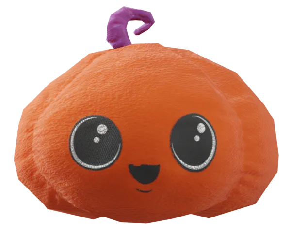

# Year of Tech Art - January: Pumpkin Toy (Blender)

  

A near year and a new monthly-ish project series: YoTA (year of technical art)! This work was done with [Blender](https://www.blender.org/) and [Krita](https://krita.org/). There's no code at all this time, I'm just storing this on github because it's what I'm familiar with now. It's also on [Sketchfab](https://skfb.ly/oDrW6).

I was trying to model a small toy I bought for my cat, just for the sake of practicing 3D modeling.
Since all the files are quite small, I've included everything - both the 3D model as well as the Krita files used to create the textures.

## Notes for future reference

### Multiresolution modifier

Modeling was done using the [multiresolution modifier](https://docs.blender.org/manual/en/latest/modeling/modifiers/generate/multiresolution.html). This is similar to the [subdivision surface modifier](https://docs.blender.org/manual/en/2.79/modeling/modifiers/generate/subsurf.html), but it allows you to sculpt on the higher density mesh. More importantly, after sculpting details on the higher multires mesh, it is very simple to 'bake' a normal map that mimics the surface normals of the high res mesh onto one of the lower res meshes. This makes it easy to create decent looking 'low-poly' versions of the model that look similar to the higher resolution mesh. I found this (very short) video tutorial especially helpful in understanding how to bake out the normal map: https://www.youtube.com/shorts/4WCuMszwM2U

### Fluffy/Plush Texture

The fluffy plush look was hard to mimic and I ended up going through multiple iterations trying to get the right look. Almost all attempts looked like some variation on an orange peel.
I originally try to sculpt some bumps/ridges to get the fluffy look, but this didn't work well, possibly because my mesh wasn't dense enough, or maybe it's just a bad approach?
While I don't think I quite got the plushy look, the approach I ended on was to texture paint (within Blender) noise onto a separate texture (which was multiplied in to the base color map), which I then saved out as a standalone texture. It's also used as a bump map, which seems to help sell the effect, though I think there's still a lot of room for improvement here.

### Bump Maps + Normal Maps

The hi-res model used a bump map for both the fluffy texture as well as the stitching texture on the mouth and eyes of the model. This worked great in hi-res, but didn't seem to get baked in to the normal map when trying to make the low-poly model. I spent a lot of time fussing with trying to make a combined normal map using the baked normals + normals baked out from the fluff/stitching bump maps, and had a lot of trouble. It turns out, however, that [bump node](https://docs.blender.org/manual/en/latest/render/shader_nodes/vector/bump.html) in Blender has a **normal** input. By passing the hi-res baked normals into this input, and the existing stitching/fluffy bumps maps in to the **bump** input, the result came out as expected, without all the confusing mess of trying to combine normal maps together. Good to know for future reference!
